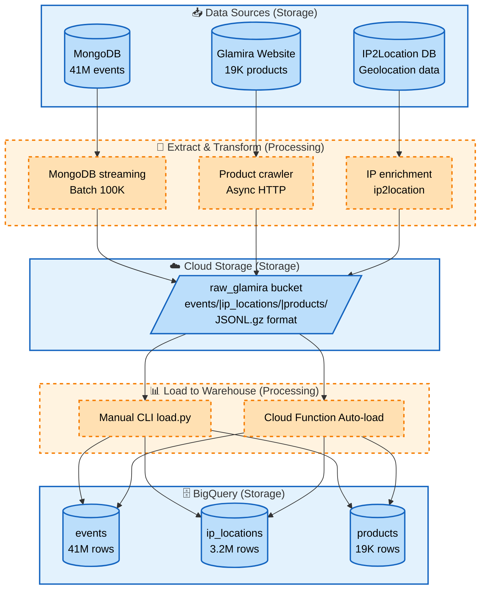

# Glamira E-commerce Analytics Pipeline

End-to-end data pipeline for analyzing user behavior from the Glamira dataset.

---

## Infrastructure

| Component      | Service              | Details                                     |
|----------------|----------------------|---------------------------------------------|
| Data storage   | Google Cloud Storage | Bucket `raw_glamira`, asia-southeast1       |
| Database       | MongoDB 7.0          | GCP VM `e2-standard-2`, us-central1-a       |
| Data warehouse | BigQuery             | Dataset `glamira_raw`, 3 tables (41M+ rows) |
| Auto-loader    | Cloud Functions      | Gen2, asia-southeast1, GCS → BigQuery       |

### Project Structure

```
ecom-analytics-pipeline/
├── bigquery/           # BigQuery operations
├── common/             # Shared infrastructure (clients, utilities)
├── config/             # Configuration
├── ingestion/          # Data ingestion pipelines
│   └── sources/        # Source-specific extractors
├── cloud_functions/    # Cloud Functions (GCS → BigQuery auto-load)
├── scripts/            # Ad-hoc scripts & exploration
├── tests/              # Test suite
├── docs/               # Code-level documentation
├── data/               # Local data (gitignored)
└── logs/               # Application logs (gitignored)
```

**Architecture:** Layered design with separation between infrastructure (`common/`), business logic (`ingestion/`, `bigquery/`), and orchestration (`cloud_functions/`).

---

## Getting Started

### Prerequisites

- GCP account with billing enabled
- Python 3.12+
- [Poetry](https://python-poetry.org/)
- [Google Cloud CLI](https://cloud.google.com/sdk/docs/install)

### Infrastructure Setup

See [`docs/setup_guide.md`](docs/setup_guide.md) for full step-by-step process:
- GCS bucket creation and data upload
- GCP VM provisioning and firewall configuration
- MongoDB installation and authentication setup
- Raw data import

### Local & VM

```bash
git clone https://github.com/plat102/ecom-analytics-pipeline.git
cd ecom-analytics-pipeline
poetry install
cp .env.example .env
# Fill in MONGO_URI and other variables
```

---

## Data Collection & Storage

### Dataset

|             |                                                                            |
|-------------|----------------------------------------------------------------------------|
| Source      | `glamira_ubl_oct2019_nov2019.tar.gz` (5.1 GB compressed, ~32 GB extracted) |
| Database    | `countly` / Collection `summary`                                           |
| Documents   | 41,432,473                                                                 |
| Period      | March 31 – June 4, 2020 (65 days)                                          |
| Event types | 27                                                                         |
| Stores      | 86 country-specific domains                                                |

#### Data Dictionary 
View: [data_dictionary.md](docs/data_dictionary.md)
for schema, field types, event types, store mapping

### Ingestion Scripts

**IP Location** - enrich 3.2M unique IPs with country/region/city:

See: [ip_location_processing.md](docs/ip_location_processing.md)

```bash
poetry run python ingestion/ip_location/extract_unique_ips.py
poetry run python ingestion/ip_location/process_ip.py \
  --bin-file /path/to/IP-COUNTRY-REGION-CITY.BIN
```

Output:
- File: `data/exports/ip_locations.csv`
- MongoDB collection: `ip_location_data`


---

**Product Crawler** - crawl product names for ~19K products from Glamira website:

See: [product_crawl.md](docs/product_crawl.md)

```bash
poetry run python ingestion/product_crawler/extract_product_urls.py
poetry run python ingestion/product_crawler/crawl_products_parallel.py --workers 5
```

Output: 
- Product names only: `data/exports/product_names.csv`
- Product data
  - Sample: 

---

## Data Pipeline & Warehouse

**Extract → Load → Transform (ELT) pipeline:**




### 1. Export to GCS

**See details:** [Export data to GCS Guide](docs/export_to_gcs.md) - Export from MongoDB, IP processing, web crawling

```bash
# MongoDB events (41M rows → 415 files)
poetry run python -m ingestion.sources.mongodb_events export

# IP locations (6.5M rows → 1 file)
poetry run python -m ingestion.sources.ip_locations.process_ip --bin-file ~/data/IP-COUNTRY-REGION-CITY.BIN

# Products (19K rows → 1 file)
poetry run python -m ingestion.sources.products pipeline --upload
```

### 2. Load GCS to BigQuery

**See details:** [Load to BigQuery Guide](docs/load_to_bigquery.md) - Manual CLI + Cloud Function auto-load

```bash
# Manual load (one-time or testing)
PYTHONPATH=. poetry run python bigquery/cli/load.py --table events

# Auto-load (production - Cloud Function)
# Triggers automatically on GCS file upload
```

---

## Data Transformation & Visualization

*To be implemented in phase 3 (dbt + Looker Studio)*

