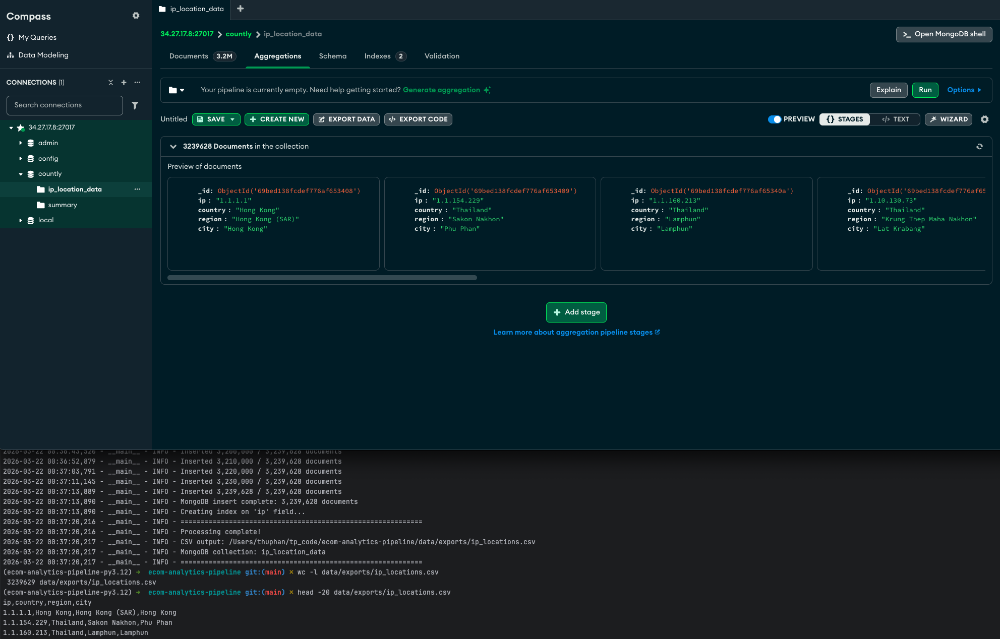

# IP Location Processing

Enrich IP addresses with geolocation data (country, region, city).

## Prerequisites

- MongoDB with `countly.summary` collection
- IP2Location BIN file: `IP-COUNTRY-REGION-CITY.BIN`

## Run scripts

### Step 1: Create Index (One-time, Recommended)

manually run in mongosh:
```
db.summary.createIndex({ "ip": 1 });

db.summary.getIndexes();
```

This improves extraction speed.

### Step 2: Extract Unique IPs

```bash
# Test with 100 IPs
poetry run python -m ingestion.sources.ip_locations.extract_unique_ips --limit 100

# Full extraction (run in tmux on VM)
poetry run python -m ingestion.sources.ip_locations.extract_unique_ips
```

Output: `data/exports/ip_list.txt`

### Step 3: Process

```bash
poetry run python -m ingestion.sources.ip_locations.process_ip \
  --bin-file ~/data/IP-COUNTRY-REGION-CITY.BIN
```

Outputs:
- `data/exports/ip_locations.csv`
- MongoDB collection: `ip_location_data`

### Verify Results

```bash
# Check CSV
wc -l data/exports/ip_locations.csv
head -20 data/exports/ip_locations.csv

# Check MongoDB
mongosh -u admin -p '<password>' --authenticationDatabase admin
use countly
db.ip_location_data.countDocuments()
db.ip_location_data.findOne()
```

## Running on VM

Use tmux for long-running operations:

```bash
tmux new -s ip_processing

# Run scripts...

# Detach: Ctrl+B then D
# Reattach: tmux attach -t ip_processing
```

---

## Result 

