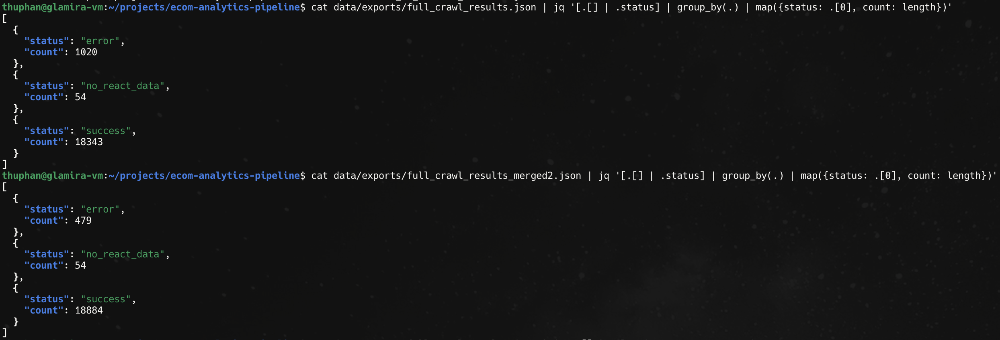

# Product Crawler - Production Guide

## Overview

Production-ready async HTTP crawler using `httpx` with HTTP/2 for extracting Glamira product data.

**Current Result (19,417 products):**

| Stage | Success | Rate | Recovery | Notes |
|-------|---------|------|----------|-------|
| Initial crawl | 18,343 | 94.5% | - | HTTP/2 + full headers |
| After DLQ retry | 18,414 | 94.8% | +71 | Lower concurrency + URL cleaning |
| After curl_cffi (1st pass) | 18,884 | 97.3% | +470 | TLS spoofing + catalog URL |
| After curl_cffi (2nd pass) | 18,917 | 97.4% | +33 | Progressive improvement |
| After no_react_data fallback | 18,938 | 97.5% | +21 | Catalog URL for listing pages |
| **Final** | **18,938** | **97.54%** | **595 total** | **55% of initial failures recovered** |

**Remaining failures (479 / 2.46%):**
- **403 errors (349)**: WAF blocking on both original and catalog URLs - likely geo-restrictions or aggressive rate limiting
- **404 errors (99)**: Products discontinued/deleted - catalog URL also returns 404
- **no_react_data (30)**: Valid HTML but no product data in either format (react_data or JSON-LD)
- **Other (1)**: Invalid URL format


**Performance**: ~3 hours for 19,417 products (15 concurrent requests)

## Quick Start - Complete Pipeline

Run the entire pipeline (extract → crawl → retry → upload) with a single command:

```bash
# Full pipeline (production)
poetry run python -m ingestion.sources.products pipeline

# Full pipeline with GCS upload
poetry run python -m ingestion.sources.products pipeline --upload

# Test pipeline (50 products)
poetry run python -m ingestion.sources.products pipeline --test 50

# Skip extraction if CSV already exists
poetry run python -m ingestion.sources.products pipeline --skip-extract

# Skip retry step (not recommended for production)
poetry run python -m ingestion.sources.products pipeline --skip-retry
```

**Pipeline flow:**
1. Extract URLs from MongoDB → `product_url_map.csv`
2. Crawl products → `full_crawl_results.json`
3. Retry failed products → `retry_YYYYMMDD_HHMMSS.json` (merged)
4. Upload to GCS (if `--upload` flag) → `gs://bucket/raw/glamira/products/YYYYMMDD/`

## Step-by-Step Usage

### (Optional) Environment Variable Overrides

All constants centralized in `config.py` with environment variable overrides.
This allows easy tuning for different environments without code changes.

```bash
# Concurrency settings
export CRAWLER_CONCURRENCY_TEST=20
export CRAWLER_CONCURRENCY_FULL=15
export CRAWLER_CONCURRENCY_DLQ=5

# Rate limiting
export CRAWLER_DELAY_MIN=0.5
export CRAWLER_DELAY_MAX=1.5
export CRAWLER_DLQ_DELAY_MIN=1.0
export CRAWLER_DLQ_DELAY_MAX=3.0

# Retry settings
export CRAWLER_MAX_RETRIES=3
export CRAWLER_BACKOFF_BASE=2.0

# Checkpoint
export CRAWLER_CHECKPOINT_INTERVAL=100
```

### Step 1: Extract Product URLs from MongoDB

```bash
# Generate product_url_map.csv from MongoDB
poetry run python -m ingestion.sources.products extract

# Custom output path
poetry run python -m ingestion.sources.products extract --output custom_output.csv

# Output: data/exports/product_url_map.csv (~19,417 rows)
```

**Alternative**: Download from GCS if already processed:
```bash
gcloud storage cp gs://raw_glamira/processed/product_url_map.csv data/exports/
```

### Step 2: Crawl Products

#### Test Mode (Recommended First)

```bash
# Test with custom count and concurrency
poetry run python -m ingestion.sources.products crawl --test 100 --concurrency 10 --skip-extract
```

#### Production: Full Crawl

**On VM (with tmux to prevent disconnection):**

```bash
# 1. Start tmux session
tmux new -s glamira_crawl

# 2. Run full crawler (crawls ALL products from CSV)
poetry run python -m ingestion.sources.products crawl --concurrency 15

# 3. Detach from tmux: Ctrl+B then D
# 4. Reattach later: tmux attach -t glamira_crawl
```

**Concurrency recommendations:**
- **Local dev**: 5-10 (avoid DNS overload)
- **VM production**: 15 (balanced speed vs stability)
- **High-memory VM**: 20 (faster, but higher risk of rate limiting)

#### Resume After Interruption

```bash
# Resume from checkpoint (skips already processed products)
poetry run python -m ingestion.sources.products crawl --resume

# Resume with custom concurrency
poetry run python -m ingestion.sources.products crawl --resume --concurrency 20
```

The crawler saves checkpoints every 100 products. If interrupted, use `--resume` to continue from where it stopped.

### Step 3: Retry Failed Products

After crawling, retry failed products with progressive strategies. **All retry outputs are timestamped merged files** containing the full dataset with improved results.

```bash
# Standard retry (httpx with lower concurrency + catalog URL fallback)
poetry run python -m ingestion.sources.products retry
# Output: retry_YYYYMMDD_HHMMSS.json (merged, all 19K products)

# Retry only 403 errors with curl_cffi (TLS spoofing + catalog URL)
poetry run python -m ingestion.sources.products retry --403-only
# Output: retry_403_YYYYMMDD_HHMMSS.json (merged, all 19K products)

# Continue improving - retry from previous retry file
poetry run python -m ingestion.sources.products retry --403-only --input data/exports/retry_20260329_143022.json
# Output: retry_403_YYYYMMDD_HHMMSS.json (new merged file)

# Analyze failure patterns (no retry)
poetry run python -m ingestion.sources.products retry --analyze

# Custom output (optional, otherwise auto-generates timestamp)
poetry run python -m ingestion.sources.products retry --output my_custom_merged.json
```

**Multi-tier Retry Strategy:**

1. **Tier 1 - DLQ Retry** (httpx):
   - Lower concurrency (5 vs 15)
   - URL cleaning (remove tracking params)
   - Longer delays (1-3s vs 0.5-1.5s)
   - **Automatic catalog URL fallback** for:
     - **403/404 errors**: Switch to stable catalog endpoint
     - **no_react_data**: Retry with catalog URL if original is category/listing page
   - Retries both `error` and `no_react_data` statuses

2. **Tier 2 - curl_cffi Retry** (for persistent 403s):
   - TLS fingerprint spoofing (bypasses WAF detection)
   - **Always uses catalog URL** (`glamira.com/catalog/product/view/id/{pid}`)
   - Bypasses both WAF detection AND geo-blocking
   - Conservative concurrency (3 workers)

3. **Progressive Improvement**:
   - Each retry outputs a **complete merged file** (all 19K products)
   - Timestamp-based naming prevents overwriting
   - Supports unlimited retry iterations
   - Use `--input` to retry from any previous output


## Monitor Progress


### Output Files

| File | Description |
|------|-------------|
| `data/exports/product_url_map.csv` | Extracted URLs from MongoDB (~19K rows) |
| `data/exports/full_crawl_results.json` | Initial crawl results (fixed name, overwrite) |
| `data/exports/test_N_results_YYYYMMDD.json` | Test mode results (timestamped) |
| `data/exports/crawl_checkpoint.json` | Auto-saved every 100 products (resume support) |
| `data/exports/retry_YYYYMMDD_HHMMSS.json` | DLQ retry - merged results (timestamped) |
| `data/exports/retry_403_YYYYMMDD_HHMMSS.json` | curl_cffi retry - merged results (timestamped) |

**Note on retry files:**
- All retry outputs are **complete merged files** (all 19K products)
- Timestamp-based naming allows unlimited retry iterations
- Each file is a standalone snapshot - upload the latest one to production

### Analyze Results

After crawling completes:

```bash
# Check success rate in final log output
# Should see: "CRAWL PASSED: XX.X% success rate"

# Check latest retry file
ls -lh data/exports/retry_*.json | tail -1
cat data/exports/retry_403_*.json | jq '[.[] | .status] | group_by(.) | map({status: .[0], count: length})'
```

```bash
# View errors
cat data/exports/full_crawl_results.json | jq '.[] | select(.status == "error")'

# Count by status
cat data/exports/full_crawl_results.json | jq '[.[] | .status] | group_by(.) | map({status: .[0], count: length})'

# Analyze failures (detailed breakdown)
poetry run python -m ingestion.sources.products retry --analyze
```



**Expected Results**

- **Initial Crawl:** 94-95% success rate
- **After Full Retry Pipeline:** 97-98% success rate (with DLQ + curl_cffi + no_react_data fallback)

**Common statuses:**
- `success`: Product data extracted successfully (react_data or JSON-LD)
- `error`: HTTP error after all retries (403/404/429/503)
- `no_react_data`: HTML fetched but no product data in either format (~30 products after fallback)

**Fallback strategies:**
- **403/404 errors**: Automatic catalog URL fallback during retry
- **no_react_data**: Automatic catalog URL fallback (handles category/listing pages)
- **429/503**: Exponential backoff (2s → 4s → 8s)
- **Persistent 403s**: curl_cffi with TLS spoofing

### Real-time Logging

**While crawler is running:**

```bash
# Attach to tmux session
tmux attach -t glamira_crawl

# Progress logged automatically:
# - Every 10 products (test mode)
# - Every 100 products (full crawl)
```

**Progress output example:**
```
[500/19417] Elapsed: 15.5min | Rate: 2.15 prod/s | ETA: 145.2min
```

## Command Reference

### Main Commands

```bash
# Show all available commands
poetry run python -m ingestion.sources.products --help

# Extract URLs from MongoDB
poetry run python -m ingestion.sources.products extract [--output FILE]

# Crawl products
poetry run python -m ingestion.sources.products crawl [OPTIONS]

# Retry failed products (DLQ)
poetry run python -m ingestion.sources.products retry [OPTIONS]

# Upload results to GCS
poetry run python -m ingestion.sources.products upload --file FILE [OPTIONS]

# Run complete pipeline
poetry run python -m ingestion.sources.products pipeline [OPTIONS]
```

### Crawl Options

```bash
# Test mode
poetry run python -m ingestion.sources.products crawl --test 50

# Full crawl with custom concurrency
poetry run python -m ingestion.sources.products crawl --concurrency 20

# Resume from checkpoint
poetry run python -m ingestion.sources.products crawl --resume

# Disable checkpointing
poetry run python -m ingestion.sources.products crawl --no-checkpoint

# Custom output file
poetry run python -m ingestion.sources.products crawl --output custom_results.json

# Combined options
poetry run python -m ingestion.sources.products crawl --test 100 --concurrency 10 --output test_100.json
```

### Retry Options

```bash
# Standard DLQ retry (httpx)
poetry run python -m ingestion.sources.products retry
# → Output: data/exports/retry_YYYYMMDD_HHMMSS.json

# Retry 403 errors with curl_cffi (from original results)
poetry run python -m ingestion.sources.products retry --403-only
# → Output: data/exports/retry_403_YYYYMMDD_HHMMSS.json

# Continue improving from previous retry
poetry run python -m ingestion.sources.products retry --403-only \
  --input data/exports/retry_20260329_143022.json
# → Output: data/exports/retry_403_YYYYMMDD_HHMMSS.json (new file)

# Analyze failures (no retry, just report)
poetry run python -m ingestion.sources.products retry --analyze

# Custom output filename (override timestamp)
poetry run python -m ingestion.sources.products retry --output my_custom_merged.json
```

**Note:** All retry commands output **complete merged files** containing all products.

## Troubleshooting

### High error rate (>5%)

**Check:**
1. HTTP 403 count (should be 0)
   - If > 0: HTTP/2 or headers issue
2. HTTP 429 count
   - If high: Reduce `--concurrency`

### Slow crawl rate (<1 prod/s)

**Possible causes:**
1. Network latency (check VM region)
2. Concurrency too low (increase to 15-20)
3. DNS resolver overload (reduce concurrency)

### tmux session killed

**On VM with limited memory:**
```bash
# Check memory before starting
free -h

# Monitor memory during crawl
watch -n 5 free -h
```


## Next Steps

### Step 4: Upload to Google Cloud Storage (Optional)

Upload final results to GCS Data Lake:

```bash
# Upload latest retry file (recommended)
poetry run python -m ingestion.sources.products upload \
  --file data/exports/retry_403_20260329_150533.json

# Upload with custom destination
poetry run python -m ingestion.sources.products upload \
  --file data/exports/retry_403_20260329_150533.json \
  --destination raw/glamira/products/manual/results.json

# Upload to different bucket
poetry run python -m ingestion.sources.products upload \
  --file data/exports/retry_403_20260329_150533.json \
  --bucket my-custom-bucket
```

**Default GCS structure:**
```
gs://ecom-analytics-data-lake/
└── raw/glamira/products/
    └── YYYYMMDD/
        ├── full_crawl_results.json
        ├── retry_YYYYMMDD_HHMMSS.json
        └── retry_403_YYYYMMDD_HHMMSS.json
```

**Configuration** (via environment variables):
```bash
export GCS_BUCKET_NAME="raw_glamira"
export GCS_DESTINATION_PREFIX="raw/glamira/products"
export AUTO_UPLOAD_TO_GCS="true"  # Auto-upload after pipeline
```

### Share GCS file

Generate a secure, temporary download link via Google Cloud Shell without making the object public.

**Method 1: Quick Share (Max 12 hours)**
- Requires the Service Account Token Creator IAM role

```
gcloud storage sign-url gs://<bucket>/<file>.json \
    --duration=12h \
    --impersonate-service-account=<service-account-email>
```

**Method 2: Extended Share (Up to 7 days)**
- Requires uploading Service Account JSON key file to Cloud Shell.

1. Authenticate using the uploaded key
```
gcloud auth activate-service-account --key-file=<key-file>.json
```

2. Generate the 7-day link
```
gcloud storage sign-url gs://<bucket>/<file>.json --duration=7d
```
